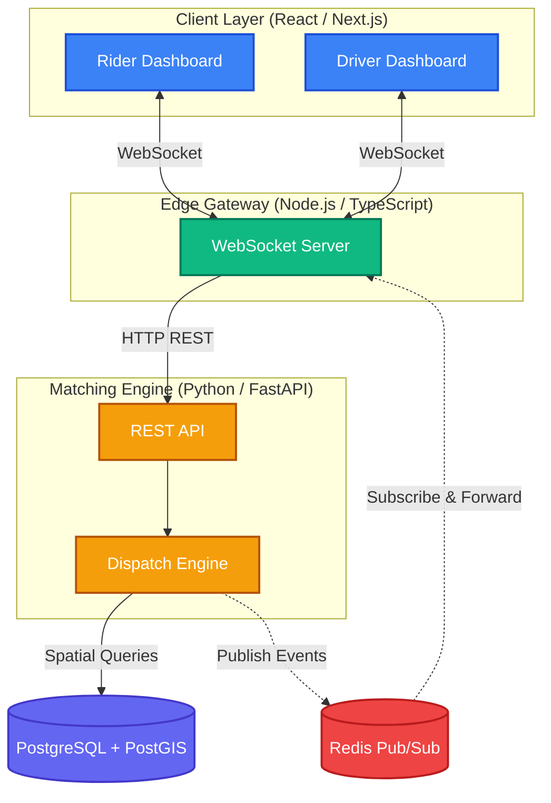

# DispatchMesh

A real-time, distributed ride-share dispatch engine built from scratch using a microservice architecture.

> Riders request a ride by clicking a map. The system finds the nearest available driver using PostGIS spatial queries, matches them instantly via Redis Pub/Sub, and streams live updates to both parties over WebSockets.

**[Live Demo →](#)** <!-- LINK COMING SOON -->

<!-- Replace with a screen recording GIF of the full rider>driver flow -->

---

## Tech Stack

| Layer | Technology |
|-------|-----------|
| **Frontend** | React, Next.js, Tailwind CSS, Leaflet Maps |
| **Gateway** | Node.js, TypeScript, WebSocket, JWT Auth |
| **Backend** | Python, FastAPI, Pydantic |
| **Database** | PostgreSQL + PostGIS (Spatial Queries) |
| **Broker** | Redis Pub/Sub |
| **DevOps** | Docker Compose, GitHub Actions CI/CD, AWS EC2 |

---

## Architecture

---

## Key Design Decisions

- **Edge Gateway Pattern**: Node.js handles messy WebSocket connections so the Python backend stays stateless and scalable.
- **Event-Driven Architecture**: Redis Pub/Sub decouples the matching engine from client delivery. Python publishes events; Node figures out who needs to hear them.
- **PostGIS Spatial Matching**: `ST_Distance` finds the nearest available driver using real geographic math, not naive coordinate subtraction.
- **Client State Hydration**: Active trips survive page refreshes. On WebSocket reconnect, the gateway queries the database and replays the appropriate event to restore the client's UI state.

---

## Features

- Interactive Leaflet map for selecting pickup and dropoff locations
- Real-time rider-driver matching via WebSocket events
- Live driver location tracking on the rider's map
- Trip cancellation for both rider and driver
- State hydration on page refresh (no lost trips)
- One-command deployment via Docker Compose
- CI/CD pipeline auto-deploys on push to `main`
